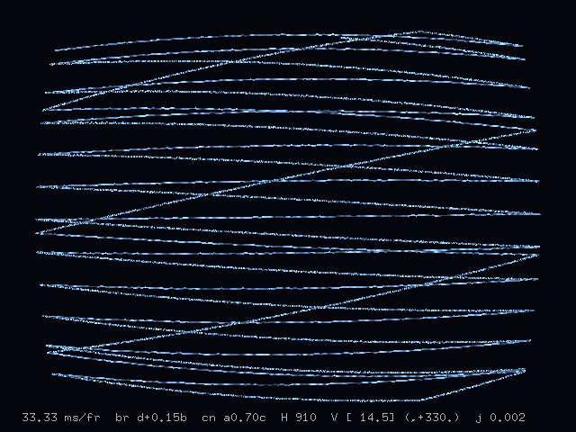

# Em-TV
Television emulator.

Traditional NTSC video "static":


Reduced number of lines to show interlacing:



To build, first install and run gl3w.
Adjust paths and libraries in Makefile for your system.
Then:

```sh
cd build
make
```
